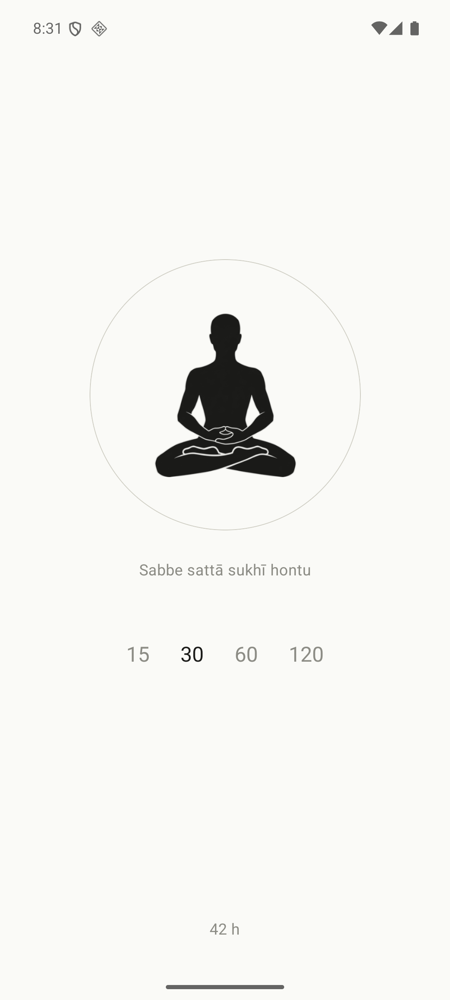
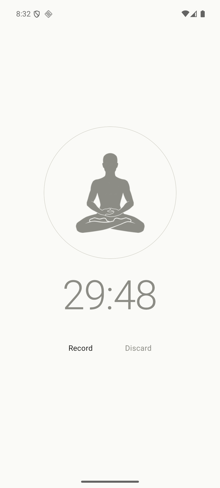
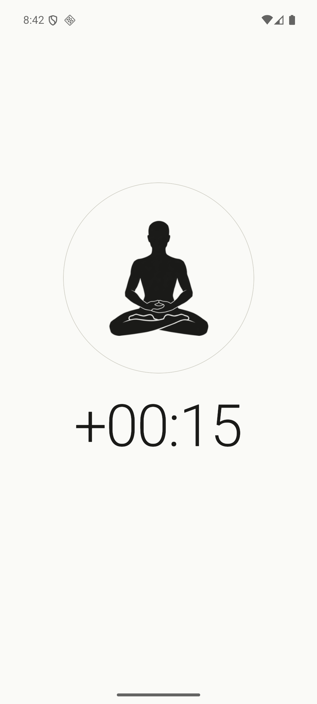
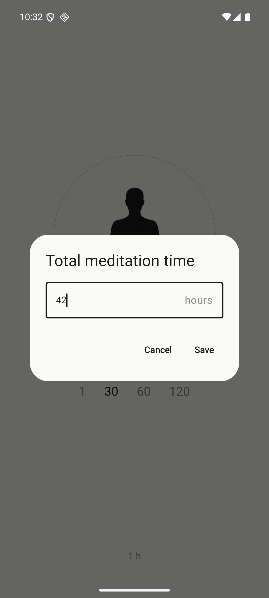

# Simple Meditation Timer

A bell marks the start and the end of a sit, and the timer keeps counting if you stay seated past it.

  
  
  
  

## What it does

- Tap to start, tap to pause, tap to resume
- A lifetime total on the home screen, editable by tapping it
- No account. No cloud. No tracking. No ads. No subscription.

## Tech

Kotlin · Jetpack Compose · Room · Coroutines. Android 8.0 and up.
